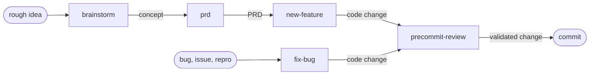
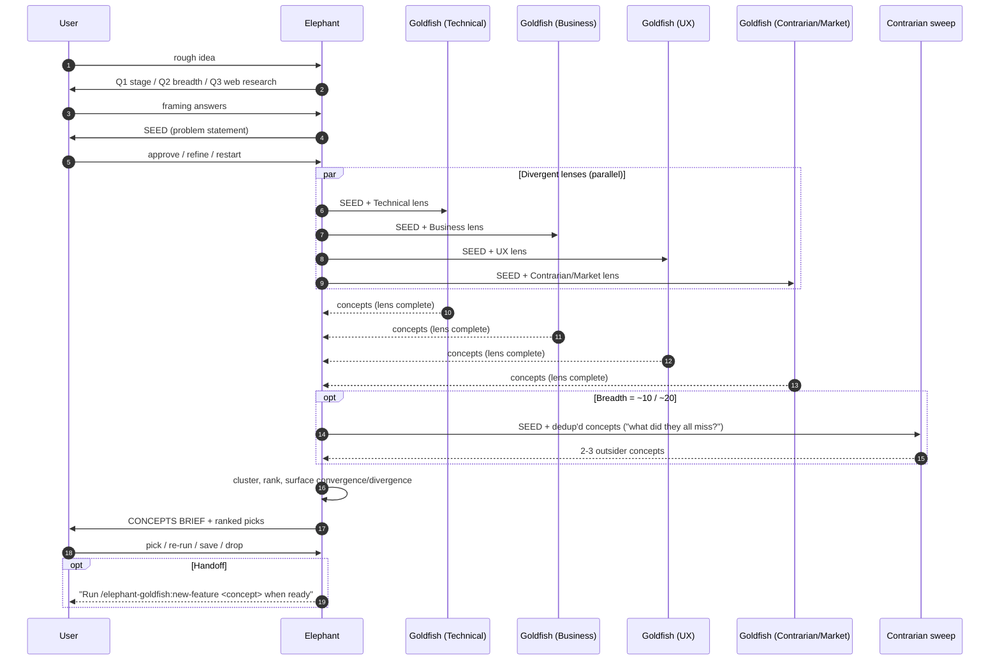
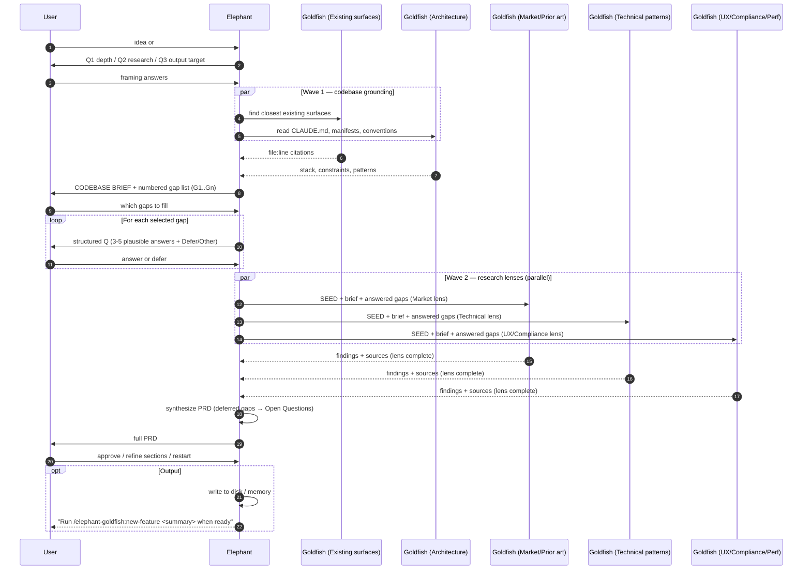
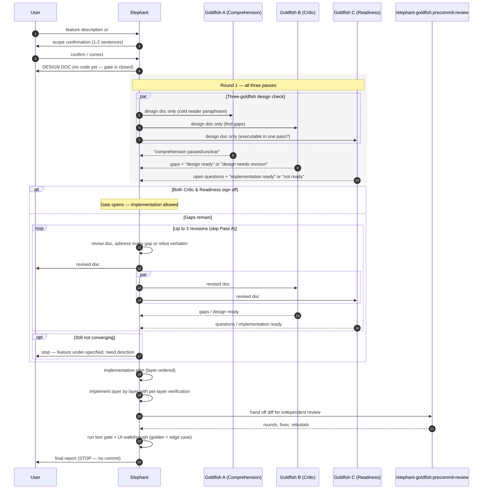
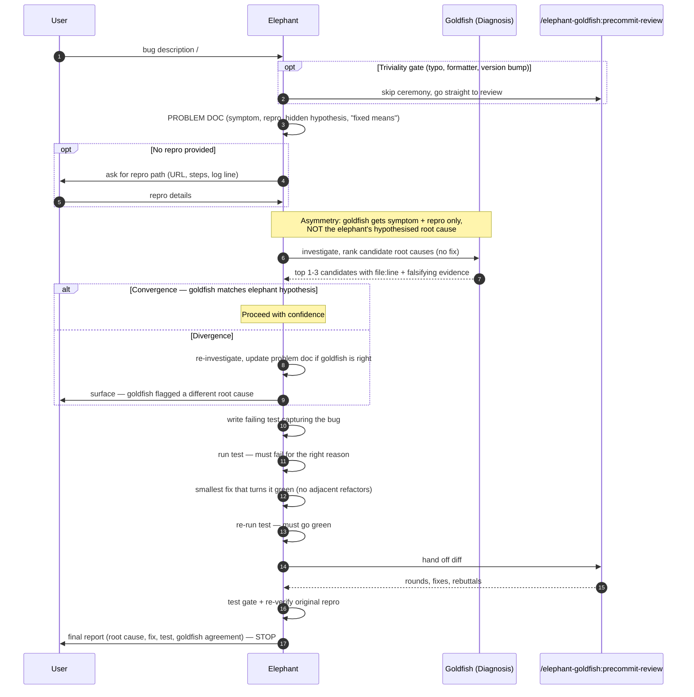
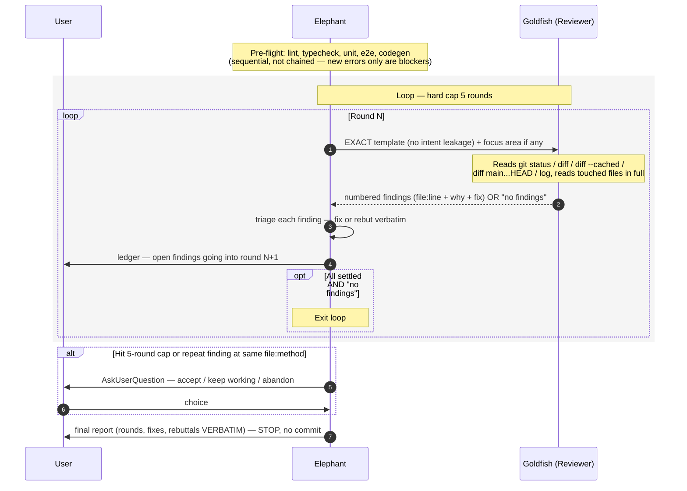

# 🐘/🐡 (Elephant/Goldfish): Claude Code plugin

A Claude Code plugin: five-stage workflow for software work, built around the elephant/goldfish pattern from [Dave Rensin's article](https://drensin.medium.com/elephants-goldfish-and-the-new-golden-age-of-software-engineering-c33641a48874).

> The **elephant** is your working session - Claude Code with full context: the conversation, CLAUDE.md, recent file reads, decisions already made. The **goldfish** is a fresh subagent with no prior context that stress-tests a problem doc, a design doc, or a diff. The asymmetry is the test: a goldfish that can't reach the same conclusion from the doc alone tells you the doc is wrong, not the goldfish.

## Install

```
/plugin install elephant-goldfish@claude-plugins-official
```

Five skills become available, namespaced under `/elephant-goldfish:`:

| Skill | When to use |
|---|---|
| `/elephant-goldfish:brainstorm <rough idea>` | Early-stage concept design. Multiple goldfish run in parallel with different lenses (technical / business / UX / contrarian / market research). Output: a concepts brief. |
| `/elephant-goldfish:prd <idea \| feature \| #issue>` | Turn an idea into a Product Requirements Document. Codebase grounding, structured gap-filling, deep research. Output: a PRD with explicit Open Questions. |
| `/elephant-goldfish:fix-bug <description \| #issue \| URL>` | Bug fix flow. Problem doc → goldfish diagnosis check → failing test → fix → precommit review → test gate. |
| `/elephant-goldfish:new-feature <description \| #issue \| URL>` | Feature flow. Scope confirm → design doc → three-goldfish design check (readiness / critic / implementer) → implement → precommit review → test gate. |
| `/elephant-goldfish:precommit-review` | Independent reviewer loop on the pending diff. Lint + typecheck + tests as pre-flight, then a fresh subagent reviews the diff cold. |

Implementation skills (`fix-bug`, `new-feature`) stop short of committing. You authorize the commit explicitly.

Usage examples:

```sh
/elephant-goldfish:fix-bug gh issue 42
/elephant-goldfish:new-feature gh issue 67
/elephant-goldfish:precommit-review
/elephant-goldfish:brainstorm "I have a an idea, but I don't know what to do with it."
/elephant-goldfish:prd "I need to implement X in Y, here is the description."
```

## The pipeline

> `brainstorm` produces a **concept**. `prd` turns a concept into **requirements**. `new-feature` and `fix-bug` produce **code**. `precommit-review` produces **validated code**. Each upstream stage feeds the next.



You don't have to start at the top. Pick the stage that matches what you have:

| You have | Start with | The output |
|---|---|---|
| A half-formed thought, no direction yet | `brainstorm` | A concepts brief; pick a direction. |
| A direction but no requirements | `prd` | A PRD: scope, users, metrics, open questions. |
| A clear feature to build | `new-feature` | Implemented + reviewed code, ready to commit. |
| A bug or a `#<issue>` | `fix-bug` | A failing-test-driven fix, ready to commit. |
| A diff already in hand | `precommit-review` | A reviewer-cleared diff, ready to commit. |

## How each skill uses the pattern

- **`brainstorm`** inverts the pattern. Multiple goldfish run in parallel, each with a different lens, free to web-search. The elephant synthesizes the divergent ideas into a concepts brief. All clarifying questions go through `AskUserQuestion`.
- **`prd`** uses two waves: exploration goldfish ground the request in the existing codebase, then research goldfish run in parallel across distinct lenses (web search, optional Chrome MCP for logged-in sources). The elephant synthesizes a PRD with explicit Open Questions for whatever the user deferred.
- **`new-feature`** uses **three** goldfish per round: comprehension (does the doc read cleanly to a cold reader?), critic (where does the design break?), readiness (could a first-pass implementer ship this without follow-up questions?). A no-code gate holds until critic AND readiness sign off; comprehension is informational. Round 2+ skips comprehension.
- **`fix-bug`** uses one goldfish to diagnose from only the symptom and repro. The elephant's hypothesis stays hidden; convergence buys confidence, divergence is signal. The bug is captured as a failing test before any fix.
- **`precommit-review`** is itself a goldfish. Sees only the diff, not the conversation. Findings triaged round by round with a hard cap and an `AskUserQuestion` escalation if the loop doesn't converge.

## Workflows

Each skill structures a different elephant↔goldfish dance. The diagrams below show the message flow. The **elephant** is your Claude Code session — full context, institutional memory. A **goldfish** is a fresh subagent spawned with no shared context, receiving only what the elephant hands it. The **user** is you, kept in the loop via `AskUserQuestion` at decision points.

### `brainstorm`

**Inverts the pattern.** Multiple goldfish run in **parallel**, each on a different lens (technical, business, UX, contrarian, market research). Their lack of shared context is what makes them generate divergent ideas. The elephant synthesizes the divergent output into a concepts brief and helps the user converge on a direction.

**Output:** a clusters → ranked picks → open questions brief; optional handoff to `/elephant-goldfish:new-feature`.



---

### `prd`

**Two waves of goldfish.** Wave 1 grounds the request in the existing codebase (parallel exploration goldfish). Wave 2 — after structured gap-filling Q&A with the user — runs research goldfish in parallel across distinct lenses. The elephant synthesizes a PRD with explicit Open Questions for whatever the user deferred.

**Output:** a PRD (executive summary, scope, requirements, metrics, risks, open questions, sources); optional save to disk and/or handoff to `/elephant-goldfish:new-feature`.



---

### `new-feature`

**Three goldfish per round** stress-test the design doc the elephant drafted. Comprehension (does the doc read cleanly to a cold reader?), Critic (what gaps?), Readiness (could a first-pass implementer ship this without asking any questions?). A **no-code gate** holds until BOTH Critic and Readiness sign off (`design ready` + `implementation ready`). Round 2+ skips Comprehension. Implementation only starts after the gate closes; then the diff goes through `/elephant-goldfish:precommit-review`.

**Output:** implemented + reviewed code, ready for the user to commit.



---

### `fix-bug`

**One goldfish diagnoses the bug** from only the symptom + repro. The elephant's hypothesis stays hidden until after the goldfish reports — convergence buys confidence; divergence is signal worth investigating. The bug gets captured as a **failing test before any fix is written**. Then the same diff goes through `/elephant-goldfish:precommit-review`.

**Output:** failing-test-driven fix, ready for the user to commit.



---

### `precommit-review`

**The reviewer is itself a goldfish.** It sees only the diff, not the conversation, not the implementation intent, not what the elephant was trying to do. Findings are triaged round by round: **fix or rebut verbatim** (no silent dismissals). The loop runs until `no findings` AND every prior-round finding is settled, with a **hard cap of 5 rounds** and structured user escalation if it doesn't converge.

**Output:** a reviewer-cleared diff with every rebuttal surfaced verbatim to the user.



## Stack support

The plugin is **stack-agnostic**. On every invocation the skill reads your repo's manifests (`package.json`, `Gemfile`, `pubspec.yaml`, `pyproject.toml`, `go.mod`, etc.), version managers (`mise.toml`, `.tool-versions`, `.nvmrc`), CI config (`.github/workflows/`), and `CLAUDE.md` itself, then picks the right lint / typecheck / test / e2e commands for that repo. No install-time configuration.

Tested patterns include Rails (with mise + Brakeman + MiniTest), Flutter (with build_runner + Drift), Node + Vite + Cloudflare Workers, Python (Django / FastAPI), and Go.

## Project-specific commands

The skills include a routing hint in `new-feature`: if your repo has its own stack-specific commands (e.g. `/new-module`, `/new-migration`, `/new-worker`), the skill suggests them instead of running its generic feature flow. Project-specific commands stay in your `.claude/commands/` and don't need to be part of this plugin.

## Local development

```sh
git clone https://github.com/<your-fork>/elephant-goldfish-plugin
cd /path/to/your-test-repo
claude --plugin-dir /path/to/elephant-goldfish-plugin
```

Inside the session:

```
/elephant-goldfish:precommit-review
```

The skill should detect your test repo's stack and run the appropriate lint / test sequence.

## License

[MIT](LICENSE).
